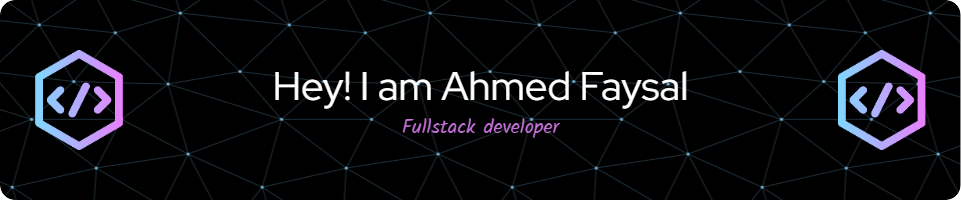
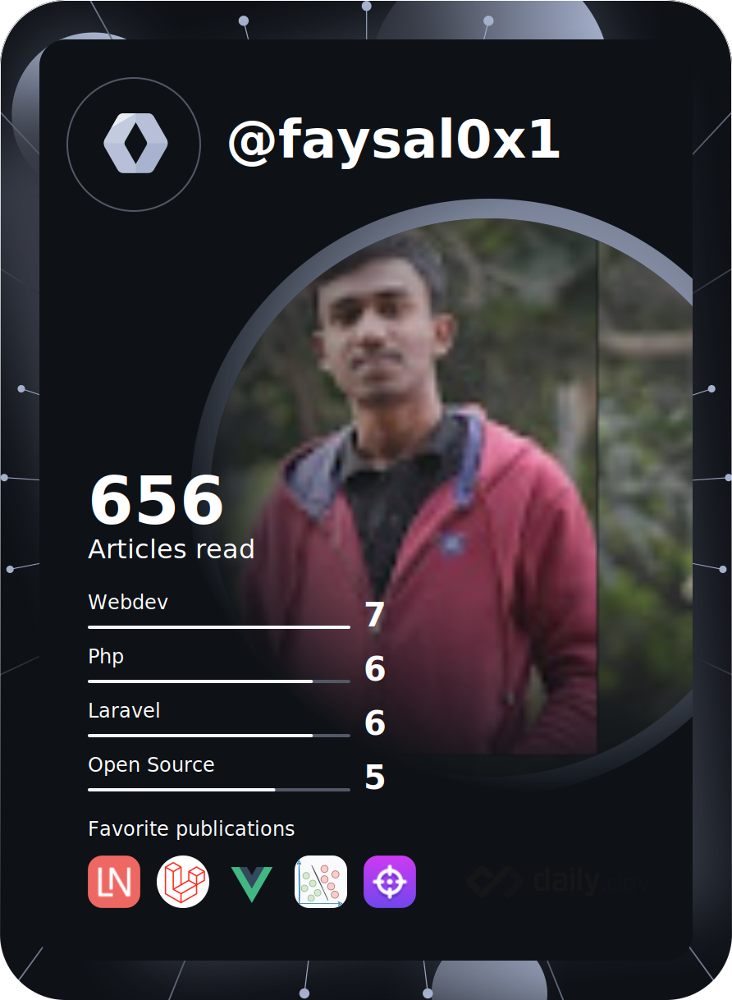
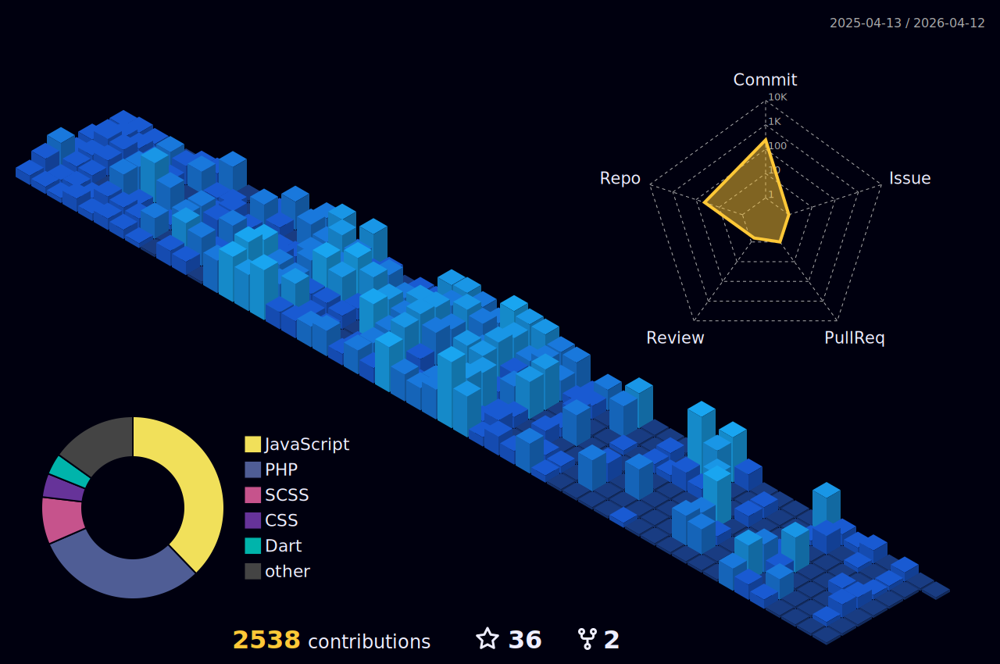
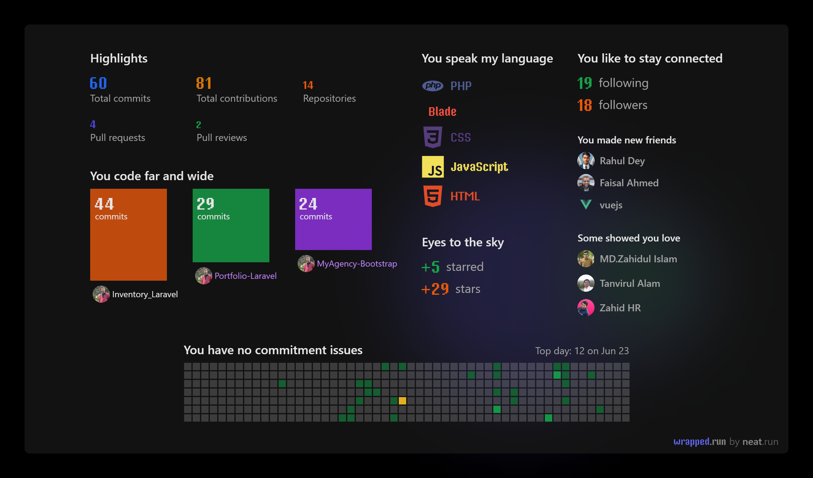

# Hi My name is Ahmed Faysal

## Laravel Developer , A Web Artisan

<p style="font-size:15px;font-weight:400;"> 
<!--  -->
<!-- <a href="https://app.daily.dev/faysal0x1"></a> -->
<a href="https://app.daily.dev/faysal0x1"></a>

<div style="margin-top:5rem;">
<p>🌍  I'm based in Bangladesh</p>
 <p>🖥️  See my portfolio at [here](http://faysalswe.com)</p>
 <p>✉️  You can contact me at <a mailto:faysalk461@gmail.com>
<b> faysalk461@gmail.com</b> </a> ()
 </p>
<p> 🧠  I'm learning Nuxt Js</p>
<p> 🤝  I'm open to collaborating on Laravel related projects</p>
</p>
</div>

<div  style="display:flex;  margin:2px;">
<div style="display:flex;  margin-right:5px;"><a margin="2px" href="https://www.github.com/faysal0x1" target="_blank" rel="noreferrer">
  
</a></div>
<div>
<a href="https://www.twitter.com/faysal0x1" target="_blank" rel="noreferrer">
  
</a>

</div>

</div>

<br>
<br>
<br>
<br>
<br>

<br>

---

<div align="center">
  <h3 styele="font-weight:900" bold>Profile Views :</h3>
  
</div>

## My Skill Set

<table><tr><td valign="top" width="33%">

### Frontend

<div align="center">  
<a href="https://en.wikipedia.org/wiki/HTML5" target="_blank"></a>  
<a href="https://www.w3schools.com/css/" target="_blank"></a>  
<a href="https://www.javascript.com/" target="_blank"></a>  
<a href="https://jquery.com/" target="_blank"></a>  
<a href="https://www.chartjs.org/" target="_blank"></a>  
<a href="https://vuejs.org/" target="_blank"></a>  
</div>

</td><td valign="top" width="33%">

### Backend

<div align="center">  
<a href="https://www.php.net/" target="_blank"></a>  
<a href="https://www.apachefriends.org/" target="_blank"></a>  
<a href="https://laravel.com/" target="_blank"></a>  
<a href="https://www.mysql.com/" target="_blank"></a>  
<a href="https://redis.io/" target="_blank"></a>  
</div>

</td><td valign="top" width="33%">

### Others

<div align="center">  
<a href="https://www.linux.org/" target="_blank"></a>  
<a href="https://github.com/" target="_blank"></a>  
<a href="https://www.figma.com/" target="_blank"></a>  
</div>

</td></tr></table>

<br/>

## Connect with me

<div align="center">
<a href="https://github.com/faysal0x1" target="_blank">

</a>
<a href="https://twitter.com/faysal0x1" target="_blank">

</a>
<a href="https://dev.to/faysal0x1" target="_blank">

</a>
<a href="https://linkedin.com/in/faysal0x1" target="_blank">

</a>
<a href="https://www.facebook.com/faysal0x2" target="_blank">

</a>
<a href="https://instagram.com/faysal0x1" target="_blank">

</a>  
</div>

<br/>

<h3 align="center">My States:</h3>

<p align="left"> 

</p>
<h3 align="center">Github Highlights:</h3>
<p align="left"> 

</p>

<h3 align="center">Activity Graph:</h3>


<br><br>

### ✍️ Quote

<p align="center">
  
</p>

<br clear="both">


###

<div align="center">

[](https://git.io/awesome-stats-card)

<h1>My Leetcode Summery</h1>


</div>

<div align="center">

  
  
</div>

###

<!--START_SECTION:waka-->


**🐱 My GitHub Data** 

> 📦 ? Used in GitHub's Storage 
 > 
> 🏆 162 Contributions in the Year 2024
 > 
> 💼 Opted to Hire
 > 
> 📜 45 Public Repositories 
 > 
> 🔑 0 Private Repositories 
 > 
**I'm a Night 🦉** 

```text
🌞 Morning                100 commits         ██░░░░░░░░░░░░░░░░░░░░░░░   08.42 % 
🌆 Daytime                195 commits         ████░░░░░░░░░░░░░░░░░░░░░   16.41 % 
🌃 Evening                572 commits         ████████████░░░░░░░░░░░░░   48.15 % 
🌙 Night                  321 commits         ███████░░░░░░░░░░░░░░░░░░   27.02 % 
```
📅 **I'm Most Productive on Monday** 

```text
Monday                   214 commits         █████░░░░░░░░░░░░░░░░░░░░   18.01 % 
Tuesday                  197 commits         ████░░░░░░░░░░░░░░░░░░░░░   16.58 % 
Wednesday                165 commits         ███░░░░░░░░░░░░░░░░░░░░░░   13.89 % 
Thursday                 196 commits         ████░░░░░░░░░░░░░░░░░░░░░   16.50 % 
Friday                   208 commits         ████░░░░░░░░░░░░░░░░░░░░░   17.51 % 
Saturday                 102 commits         ██░░░░░░░░░░░░░░░░░░░░░░░   08.59 % 
Sunday                   106 commits         ██░░░░░░░░░░░░░░░░░░░░░░░   08.92 % 
```


📊 **This Week I Spent My Time On** 

```text
🕑︎ Time Zone: Asia/Dhaka

💬 Programming Languages: 
PHP                      13 hrs 16 mins      ████████████░░░░░░░░░░░░░   46.86 % 
Blade Template           8 hrs 17 mins       ███████░░░░░░░░░░░░░░░░░░   29.27 % 
Jupyter                  4 hrs 9 mins        ████░░░░░░░░░░░░░░░░░░░░░   14.66 % 
Python                   42 mins             █░░░░░░░░░░░░░░░░░░░░░░░░   02.48 % 
Bash                     38 mins             █░░░░░░░░░░░░░░░░░░░░░░░░   02.25 % 

🔥 Editors: 
VS Code                  23 hrs 31 mins      █████████████████████░░░░   83.05 % 
PyCharm                  4 hrs 47 mins       ████░░░░░░░░░░░░░░░░░░░░░   16.91 % 
WebStorm                 0 secs              ░░░░░░░░░░░░░░░░░░░░░░░░░   00.03 % 

🐱‍💻 Projects: 
wqims                    14 hrs 50 mins      █████████████░░░░░░░░░░░░   52.37 % 
Riyotex                  8 hrs 23 mins       ███████░░░░░░░░░░░░░░░░░░   29.64 % 
SentimentAnalysis        4 hrs 25 mins       ████░░░░░░░░░░░░░░░░░░░░░   15.64 % 
Unknown Project          31 mins             ░░░░░░░░░░░░░░░░░░░░░░░░░   01.84 % 
VUE                      3 mins              ░░░░░░░░░░░░░░░░░░░░░░░░░   00.23 % 

💻 Operating System: 
Windows                  28 hrs 19 mins      █████████████████████████   100.00 % 
```

**I Mostly Code in JavaScript** 

```text
HTML                     14 repos            █████░░░░░░░░░░░░░░░░░░░░   18.92 % 
PHP                      11 repos            ████░░░░░░░░░░░░░░░░░░░░░   14.86 % 
CSS                      10 repos            ███░░░░░░░░░░░░░░░░░░░░░░   13.51 % 
Vue                      3 repos             █░░░░░░░░░░░░░░░░░░░░░░░░   04.05 % 
Jupyter Notebook         1 repo              ░░░░░░░░░░░░░░░░░░░░░░░░░   01.35 % 
```


**Timeline**


 Last Updated on 12/05/2024 01:11:44 UTC
<!--END_SECTION:waka-->

**Timeline**


## 🏆GitHub Trophies


