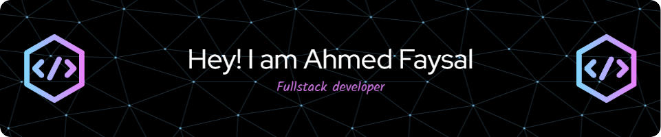
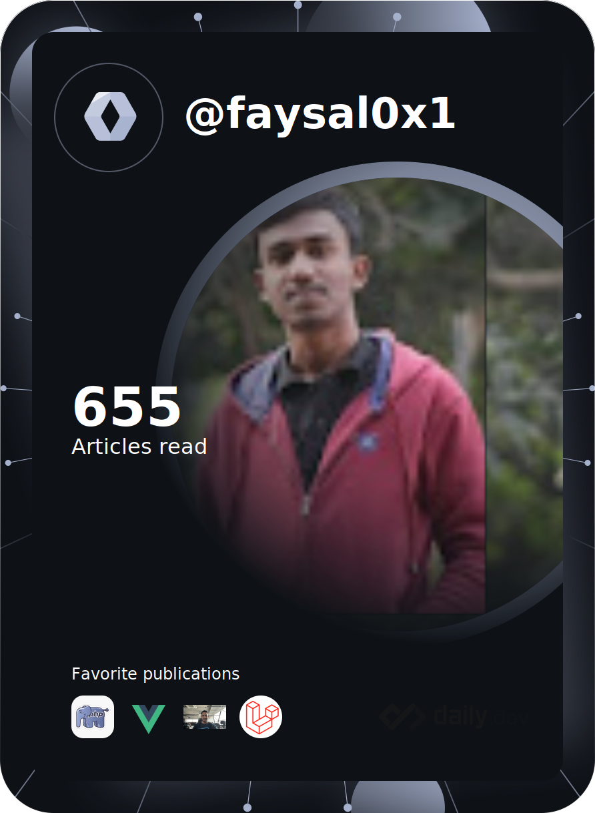
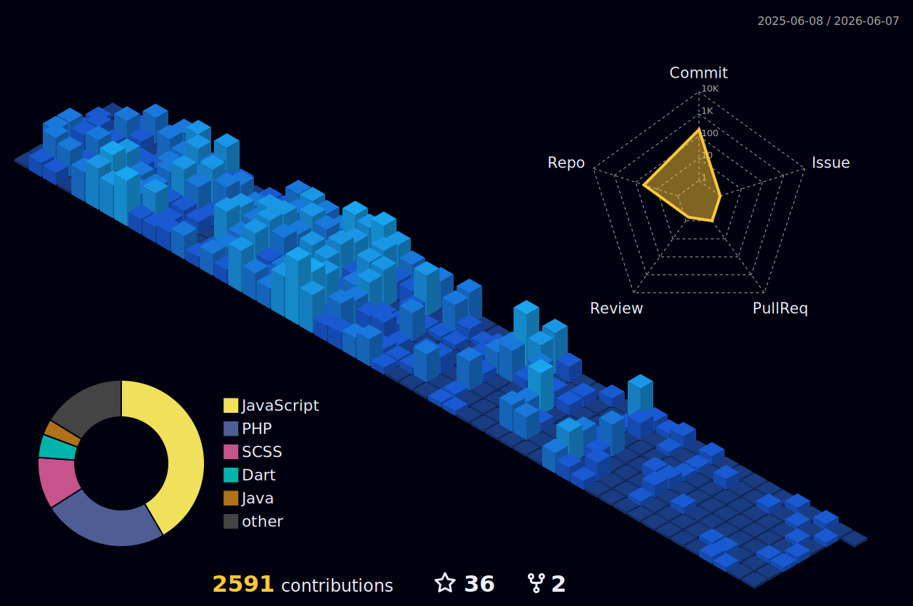
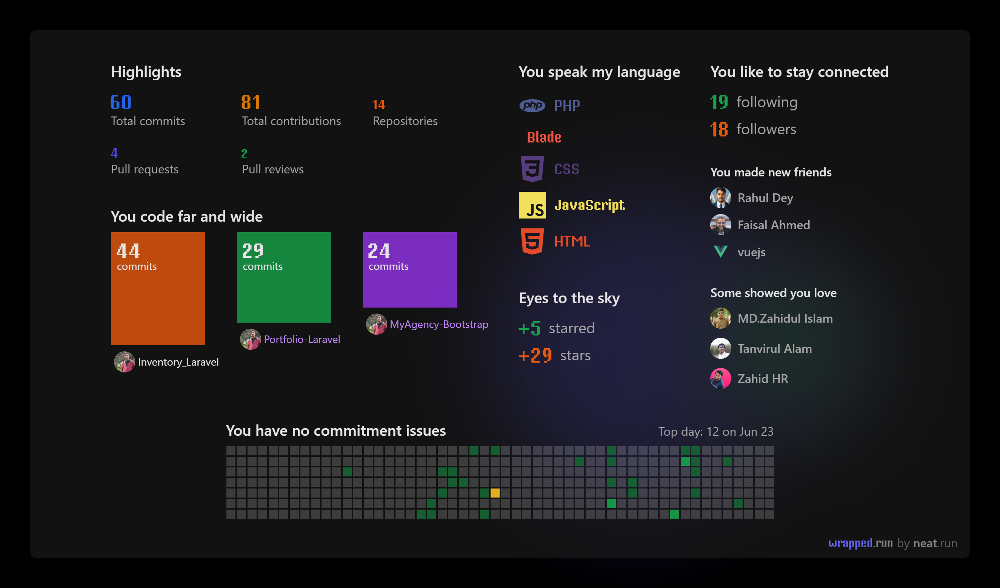

# Hi My name is Ahmed Faysal

## Laravel Developer , A Web Artisan

<p style="font-size:15px;font-weight:400;"> 
<!--  -->
<!-- <a href="https://app.daily.dev/faysal0x1"></a> -->
<a href="https://app.daily.dev/faysal0x1"></a>

<div style="margin-top:5rem;">
<p>🌍  I'm based in Bangladesh</p>
 <p>🖥️  See my portfolio at [here](http://faysalswe.com)</p>
 <p>✉️  You can contact me at <a mailto:faysalk461@gmail.com>
<b> faysalk461@gmail.com</b> </a> ()
 </p>
<p> 🧠  I'm learning Nuxt Js</p>
<p> 🤝  I'm open to collaborating on Laravel related projects</p>
</p>
</div>

<div  style="display:flex;  margin:2px;">
<div style="display:flex;  margin-right:5px;"><a margin="2px" href="https://www.github.com/faysal0x1" target="_blank" rel="noreferrer">
  
</a></div>
<div>
<a href="https://www.twitter.com/faysal0x1" target="_blank" rel="noreferrer">
  
</a>

</div>

</div>

<br>
<br>
<br>
<br>
<br>

<br>

---

<div align="center">
  <h3 styele="font-weight:900" bold>Profile Views :</h3>
  
</div>

## My Skill Set

<table><tr><td valign="top" width="33%">

### Frontend

<div align="center">  
<a href="https://en.wikipedia.org/wiki/HTML5" target="_blank"></a>  
<a href="https://www.w3schools.com/css/" target="_blank"></a>  
<a href="https://www.javascript.com/" target="_blank"></a>  
<a href="https://jquery.com/" target="_blank"></a>  
<a href="https://www.chartjs.org/" target="_blank"></a>  
<a href="https://vuejs.org/" target="_blank"></a>  
</div>

</td><td valign="top" width="33%">

### Backend

<div align="center">  
<a href="https://www.php.net/" target="_blank"></a>  
<a href="https://www.apachefriends.org/" target="_blank"></a>  
<a href="https://laravel.com/" target="_blank"></a>  
<a href="https://www.mysql.com/" target="_blank"></a>  
<a href="https://redis.io/" target="_blank"></a>  
</div>

</td><td valign="top" width="33%">

### Others

<div align="center">  
<a href="https://www.linux.org/" target="_blank"></a>  
<a href="https://github.com/" target="_blank"></a>  
<a href="https://www.figma.com/" target="_blank"></a>  
</div>

</td></tr></table>

<br/>

## Connect with me

<div align="center">
<a href="https://github.com/faysal0x1" target="_blank">

</a>
<a href="https://twitter.com/faysal0x1" target="_blank">

</a>
<a href="https://dev.to/faysal0x1" target="_blank">

</a>
<a href="https://linkedin.com/in/faysal0x1" target="_blank">

</a>
<a href="https://www.facebook.com/faysal0x2" target="_blank">

</a>
<a href="https://instagram.com/faysal0x1" target="_blank">

</a>  
</div>

<br/>

<h3 align="center">My States:</h3>

<p align="left"> 

</p>
<h3 align="center">Github Highlights:</h3>
<p align="left"> 

</p>

<h3 align="center">Activity Graph:</h3>


<br><br>

### ✍️ Quote

<p align="center">
  
</p>

<br clear="both">


###

<div align="center">

[](https://git.io/awesome-stats-card)

<h1>My Leetcode Summery</h1>


</div>

<div align="center">

  
  
</div>

###

<!--START_SECTION:waka-->


**🐱 My GitHub Data** 

> 📦 ? Used in GitHub's Storage 
 > 
> 🏆 402 Contributions in the Year 2026
 > 
> 💼 Opted to Hire
 > 
> 📜 103 Public Repositories 
 > 
> 🔑 0 Private Repositories 
 > 
**I'm a Night 🦉** 

```text
🌞 Morning                4675 commits        ████░░░░░░░░░░░░░░░░░░░░░   16.22 % 
🌆 Daytime                8613 commits        ███████░░░░░░░░░░░░░░░░░░   29.88 % 
🌃 Evening                9491 commits        ████████░░░░░░░░░░░░░░░░░   32.92 % 
🌙 Night                  6049 commits        █████░░░░░░░░░░░░░░░░░░░░   20.98 % 
```
📅 **I'm Most Productive on Monday** 

```text
Monday                   4820 commits        ████░░░░░░░░░░░░░░░░░░░░░   16.72 % 
Tuesday                  3902 commits        ███░░░░░░░░░░░░░░░░░░░░░░   13.54 % 
Wednesday                3819 commits        ███░░░░░░░░░░░░░░░░░░░░░░   13.25 % 
Thursday                 3172 commits        ███░░░░░░░░░░░░░░░░░░░░░░   11.00 % 
Friday                   4222 commits        ████░░░░░░░░░░░░░░░░░░░░░   14.65 % 
Saturday                 4340 commits        ████░░░░░░░░░░░░░░░░░░░░░   15.05 % 
Sunday                   4553 commits        ████░░░░░░░░░░░░░░░░░░░░░   15.79 % 
```


📊 **This Week I Spent My Time On** 

```text
🕑︎ Time Zone: Asia/Dhaka

💬 Programming Languages: 
PHP                      7 hrs 55 mins       ███████████░░░░░░░░░░░░░░   44.23 % 
Blade Template           3 hrs 58 mins       ██████░░░░░░░░░░░░░░░░░░░   22.18 % 
Bash                     2 hrs 12 mins       ███░░░░░░░░░░░░░░░░░░░░░░   12.32 % 
C#                       1 hr 17 mins        ██░░░░░░░░░░░░░░░░░░░░░░░   07.24 % 
Other                    41 mins             █░░░░░░░░░░░░░░░░░░░░░░░░   03.82 % 

🔥 Editors: 
VS Code                  8 hrs 37 mins       ████████████░░░░░░░░░░░░░   48.13 % 
PhpStorm                 5 hrs 49 mins       ████████░░░░░░░░░░░░░░░░░   32.54 % 
Rider                    2 hrs 1 min         ███░░░░░░░░░░░░░░░░░░░░░░   11.31 % 
Cursor                   1 hr 26 mins        ██░░░░░░░░░░░░░░░░░░░░░░░   08.02 % 

🐱‍💻 Projects: 
crm                      14 hrs 38 mins      ████████████████████░░░░░   81.71 % 
dotmvc                   1 hr 53 mins        ███░░░░░░░░░░░░░░░░░░░░░░   10.52 % 
ecommerce-web-api        37 mins             █░░░░░░░░░░░░░░░░░░░░░░░░   03.48 % 
portfolio                27 mins             █░░░░░░░░░░░░░░░░░░░░░░░░   02.58 % 
ef4bd9c8-6ec7-4d60-9bc6-a14 mins             ░░░░░░░░░░░░░░░░░░░░░░░░░   01.35 % 

💻 Operating System: 
Mac                      16 hrs 33 mins      ███████████████████████░░   92.42 % 
Windows                  1 hr 21 mins        ██░░░░░░░░░░░░░░░░░░░░░░░   07.58 % 
```

**I Mostly Code in JavaScript** 

```text
JavaScript               78 repos            ██████████░░░░░░░░░░░░░░░   39.39 % 
PHP                      45 repos            ██████░░░░░░░░░░░░░░░░░░░   22.73 % 
TypeScript               6 repos             █░░░░░░░░░░░░░░░░░░░░░░░░   03.03 % 
Dart                     4 repos             █░░░░░░░░░░░░░░░░░░░░░░░░   02.02 % 
Shell                    1 repo              ░░░░░░░░░░░░░░░░░░░░░░░░░   00.51 % 
```


**Timeline**


 Last Updated on 26/04/2026 03:58:32 UTC
<!--END_SECTION:waka-->

**Timeline**


## 🏆GitHub Trophies


