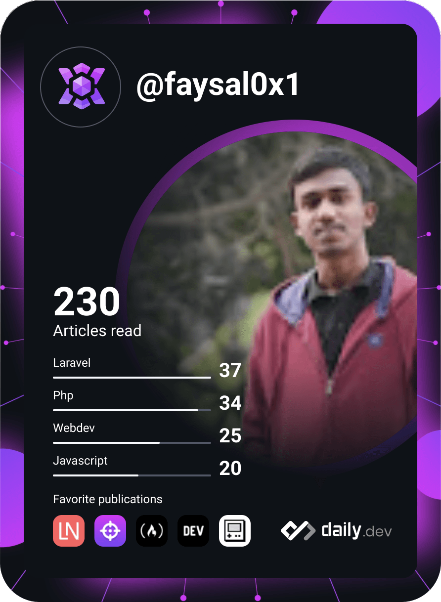

# Hi My name is Ahmed Faysal

## Laravel Developer , A Web Artisan

<p style="font-size:15px;font-weight:400;"> 
<!--  -->
<a href="https://app.daily.dev/faysal0x1"></a>

<div style="margin-top:5rem;">
<p>🌍  I'm based in Bangladesh</p>
 <p>🖥️  See my portfolio at [here](http://faysalswe.com)</p>
 <p>✉️  You can contact me at <a mailto:faysalk461@gmail.com>
<b> faysalk461@gmail.com</b> </a> ()
 </p>
<p> 🧠  I'm learning Nuxt Js</p>
<p> 🤝  I'm open to collaborating on Laravel related projects</p>
</p>
</div>

<div  style="display:flex;  margin:2px;">
<div style="display:flex;  margin-right:5px;"><a margin="2px" href="https://www.github.com/faysal0x1" target="_blank" rel="noreferrer">
  
</a></div>
<div>
<a href="https://www.twitter.com/faysal0x1" target="_blank" rel="noreferrer">
  
</a>

</div>

</div>

<br>
<br>
<br>
<br>
<br>

## My Skill Set

<table><tr><td valign="top" width="33%">

### Frontend

<div align="center">  
<a href="https://en.wikipedia.org/wiki/HTML5" target="_blank"></a>  
<a href="https://www.w3schools.com/css/" target="_blank"></a>  
<a href="https://www.javascript.com/" target="_blank"></a>  
<a href="https://jquery.com/" target="_blank"></a>  
<a href="https://www.chartjs.org/" target="_blank"></a>  
<a href="https://vuejs.org/" target="_blank"></a>  
</div>

</td><td valign="top" width="33%">

### Backend

<div align="center">  
<a href="https://www.php.net/" target="_blank"></a>  
<a href="https://www.apachefriends.org/" target="_blank"></a>  
<a href="https://laravel.com/" target="_blank"></a>  
<a href="https://www.mysql.com/" target="_blank"></a>  
<a href="https://redis.io/" target="_blank"></a>  
</div>

</td><td valign="top" width="33%">

### Others

<div align="center">  
<a href="https://www.linux.org/" target="_blank"></a>  
<a href="https://github.com/" target="_blank"></a>  
<a href="https://www.figma.com/" target="_blank"></a>  
</div>

</td></tr></table>

<br/>

## Connect with me

<div align="center">
<a href="https://github.com/faysal0x1" target="_blank">

</a>
<a href="https://twitter.com/faysal0x1" target="_blank">

</a>
<a href="https://dev.to/faysal0x1" target="_blank">

</a>
<a href="https://linkedin.com/in/faysal0x1" target="_blank">

</a>
<a href="https://www.facebook.com/faysal0x2" target="_blank">

</a>
<a href="https://instagram.com/faysal0x1" target="_blank">

</a>  
</div>

<br/>

<h3 align="center">My States:</h3>

<p align="left"> 

</p>
<h3 align="center">Github Highlights:</h3>
<p align="left"> 

</p>


<h3 align="center">Activity Graph:</h3>


<br><br>

### ✍️ Quote

<p align="center">
  
</p>

<br clear="both">


###

<div align="center">

[](https://git.io/awesome-stats-card)

<h1>My Leetcode Summery</h1>


</div>

<div align="center">

  
  
</div>

###

<!--START_SECTION:waka-->

<<<<<<< HEAD

# 


> > > > > > > bb25461f3034b83fa6da9506a4d13afb0d64c760


**🐱 My GitHub Data**

<<<<<<< HEAD

> 📦 ? Used in GitHub's Storage
>
> 🏆 366 Contributions in the Year 2023
>
> 💼 Opted to Hire
>
> 📜 36 Public Repositories
>
> 🔑 0 Private Repositories
>
> **I'm a Night 🦉**

```text
🌞 Morning                57 commits          ██░░░░░░░░░░░░░░░░░░░░░░░   09.79 %
🌆 Daytime                127 commits         █████░░░░░░░░░░░░░░░░░░░░   21.82 %
🌃 Evening                215 commits         █████████░░░░░░░░░░░░░░░░   36.94 %
🌙 Night                  183 commits         ████████░░░░░░░░░░░░░░░░░   31.44 %
```

📅 **I'm Most Productive on Wednesday**

````text
Monday                   119 commits         █████░░░░░░░░░░░░░░░░░░░░   20.45 %
Tuesday                  66 commits          ███░░░░░░░░░░░░░░░░░░░░░░   11.34 %
Wednesday                122 commits         █████░░░░░░░░░░░░░░░░░░░░   20.96 %
Thursday                 69 commits          ███░░░░░░░░░░░░░░░░░░░░░░   11.86 %
Friday                   113 commits         █████░░░░░░░░░░░░░░░░░░░░   19.42 %
Saturday                 43 commits          ██░░░░░░░░░░░░░░░░░░░░░░░   07.39 %
Sunday                   50 commits          ██░░░░░░░░░░░░░░░░░░░░░░░   08.59 %
=======
> 📦 ? Used in GitHub's Storage
 >
> 🏆 33 Contributions in the Year 2024
 >
> 💼 Opted to Hire
 >
> 📜 42 Public Repositories
 >
> 🔑 0 Private Repositories
 >
**I'm a Night 🦉**

```text
🌞 Morning                67 commits          ███░░░░░░░░░░░░░░░░░░░░░░   10.01 %
🌆 Daytime                133 commits         █████░░░░░░░░░░░░░░░░░░░░   19.88 %
🌃 Evening                269 commits         ██████████░░░░░░░░░░░░░░░   40.21 %
🌙 Night                  200 commits         ███████░░░░░░░░░░░░░░░░░░   29.90 %
````

📅 **I'm Most Productive on Monday**

```text
Monday                   134 commits         █████░░░░░░░░░░░░░░░░░░░░   20.03 %
Tuesday                  86 commits          ███░░░░░░░░░░░░░░░░░░░░░░   12.86 %
Wednesday                123 commits         █████░░░░░░░░░░░░░░░░░░░░   18.39 %
Thursday                 113 commits         ████░░░░░░░░░░░░░░░░░░░░░   16.89 %
Friday                   117 commits         ████░░░░░░░░░░░░░░░░░░░░░   17.49 %
Saturday                 45 commits          ██░░░░░░░░░░░░░░░░░░░░░░░   06.73 %
Sunday                   51 commits          ██░░░░░░░░░░░░░░░░░░░░░░░   07.62 %
>>>>>>> bb25461f3034b83fa6da9506a4d13afb0d64c760
```

📊 **This Week I Spent My Time On**

```text
🕑︎ Time Zone: Asia/Dhaka

<<<<<<< HEAD
💬 Programming Languages:
Blade Template           6 hrs 58 mins       ████████████░░░░░░░░░░░░░   48.81 %
PHP                      5 hrs 18 mins       █████████░░░░░░░░░░░░░░░░   37.14 %
Vue.js                   1 hr 4 mins         ██░░░░░░░░░░░░░░░░░░░░░░░   07.51 %
Other                    16 mins             ░░░░░░░░░░░░░░░░░░░░░░░░░   01.92 %
SQL                      14 mins             ░░░░░░░░░░░░░░░░░░░░░░░░░   01.73 %

🔥 Editors:
VS Code                  14 hrs 18 mins      █████████████████████████   100.00 %

🐱‍💻 Projects:
PortfolioSite            8 hrs 23 mins       ███████████████░░░░░░░░░░   58.65 %
LeetCode                 3 hrs 5 mins        █████░░░░░░░░░░░░░░░░░░░░   21.65 %
hiya_deployement_version 1 hr 19 mins        ██░░░░░░░░░░░░░░░░░░░░░░░   09.21 %
Weather-App              1 hr 5 mins         ██░░░░░░░░░░░░░░░░░░░░░░░   07.60 %
Riyotex                  9 mins              ░░░░░░░░░░░░░░░░░░░░░░░░░   01.16 %

💻 Operating System:
Windows                  14 hrs 18 mins      █████████████████████████   100.00 %
=======
💬 Programming Languages:
Blade Template           9 hrs               ████████░░░░░░░░░░░░░░░░░   30.27 %
PHP                      8 hrs 38 mins       ███████░░░░░░░░░░░░░░░░░░   29.05 %
JavaScript               6 hrs 57 mins       ██████░░░░░░░░░░░░░░░░░░░   23.42 %
CSS                      2 hrs 17 mins       ██░░░░░░░░░░░░░░░░░░░░░░░   07.71 %
Jupyter                  1 hr 51 mins        ██░░░░░░░░░░░░░░░░░░░░░░░   06.24 %

🔥 Editors:
VS Code                  27 hrs 13 mins      ███████████████████████░░   91.55 %
PyCharm                  2 hrs 4 mins        ██░░░░░░░░░░░░░░░░░░░░░░░   06.99 %
WebStorm                 26 mins             ░░░░░░░░░░░░░░░░░░░░░░░░░   01.47 %

🐱‍💻 Projects:
wqims                    16 hrs 14 mins      ██████████████░░░░░░░░░░░   54.63 %
Riyotex                  10 hrs 18 mins      █████████░░░░░░░░░░░░░░░░   34.67 %
SentimentAnalysis        1 hr 15 mins        █░░░░░░░░░░░░░░░░░░░░░░░░   04.21 %
Ecommerce                35 mins             ░░░░░░░░░░░░░░░░░░░░░░░░░   01.97 %
Unknown Project          31 mins             ░░░░░░░░░░░░░░░░░░░░░░░░░   01.75 %

💻 Operating System:
Windows                  29 hrs 43 mins      █████████████████████████   100.00 %
>>>>>>> bb25461f3034b83fa6da9506a4d13afb0d64c760
```

**I Mostly Code in JavaScript**

```text
<<<<<<< HEAD
JavaScript               21 repos            ████████░░░░░░░░░░░░░░░░░   32.31 %
CSS                      10 repos            ████░░░░░░░░░░░░░░░░░░░░░   15.38 %
Blade                    7 repos             ███░░░░░░░░░░░░░░░░░░░░░░   10.77 %
PHP                      7 repos             ███░░░░░░░░░░░░░░░░░░░░░░   10.77 %
Vue                      2 repos             █░░░░░░░░░░░░░░░░░░░░░░░░   03.08 %
=======
JavaScript               24 repos            █████████░░░░░░░░░░░░░░░░   34.78 %
CSS                      10 repos            ████░░░░░░░░░░░░░░░░░░░░░   14.49 %
PHP                      9 repos             ███░░░░░░░░░░░░░░░░░░░░░░   13.04 %
Vue                      2 repos             █░░░░░░░░░░░░░░░░░░░░░░░░   02.90 %
Jupyter Notebook         1 repo              ░░░░░░░░░░░░░░░░░░░░░░░░░   01.45 %
>>>>>>> bb25461f3034b83fa6da9506a4d13afb0d64c760
```

**Timeline**


## 🏆GitHub Trophies


