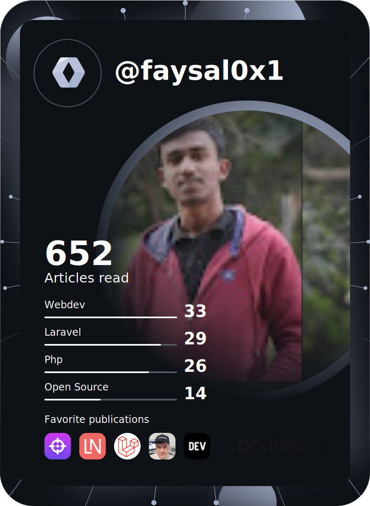
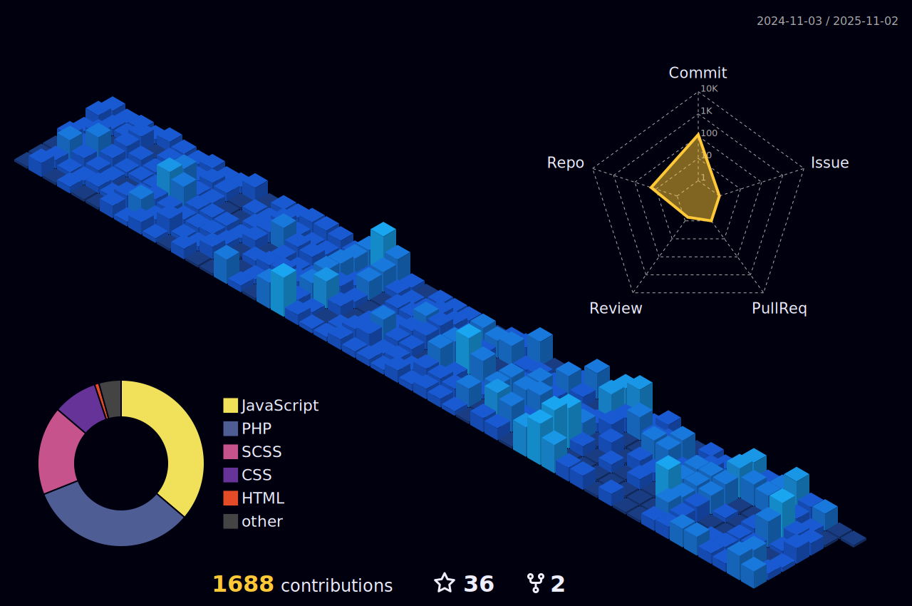

# Hi My name is Ahmed Faysal

## Laravel Developer , A Web Artisan

<p style="font-size:15px;font-weight:400;"> 
<!--  -->
<!-- <a href="https://app.daily.dev/faysal0x1"></a> -->
<a href="https://app.daily.dev/faysal0x1"></a>

<div style="margin-top:5rem;">
<p>🌍  I'm based in Bangladesh</p>
 <p>🖥️  See my portfolio at [here](http://faysalswe.com)</p>
 <p>✉️  You can contact me at <a mailto:faysalk461@gmail.com>
<b> faysalk461@gmail.com</b> </a> ()
 </p>
<p> 🧠  I'm learning Nuxt Js</p>
<p> 🤝  I'm open to collaborating on Laravel related projects</p>
</p>
</div>

<div  style="display:flex;  margin:2px;">
<div style="display:flex;  margin-right:5px;"><a margin="2px" href="https://www.github.com/faysal0x1" target="_blank" rel="noreferrer">
  
</a></div>
<div>
<a href="https://www.twitter.com/faysal0x1" target="_blank" rel="noreferrer">
  
</a>

</div>

</div>

<br>
<br>
<br>
<br>
<br>

<br>

---

<div align="center">
  <h3 styele="font-weight:900" bold>Profile Views :</h3>
  
</div>

## My Skill Set

<table><tr><td valign="top" width="33%">

### Frontend

<div align="center">  
<a href="https://en.wikipedia.org/wiki/HTML5" target="_blank"></a>  
<a href="https://www.w3schools.com/css/" target="_blank"></a>  
<a href="https://www.javascript.com/" target="_blank"></a>  
<a href="https://jquery.com/" target="_blank"></a>  
<a href="https://www.chartjs.org/" target="_blank"></a>  
<a href="https://vuejs.org/" target="_blank"></a>  
</div>

</td><td valign="top" width="33%">

### Backend

<div align="center">  
<a href="https://www.php.net/" target="_blank"></a>  
<a href="https://www.apachefriends.org/" target="_blank"></a>  
<a href="https://laravel.com/" target="_blank"></a>  
<a href="https://www.mysql.com/" target="_blank"></a>  
<a href="https://redis.io/" target="_blank"></a>  
</div>

</td><td valign="top" width="33%">

### Others

<div align="center">  
<a href="https://www.linux.org/" target="_blank"></a>  
<a href="https://github.com/" target="_blank"></a>  
<a href="https://www.figma.com/" target="_blank"></a>  
</div>

</td></tr></table>

<br/>

## Connect with me

<div align="center">
<a href="https://github.com/faysal0x1" target="_blank">

</a>
<a href="https://twitter.com/faysal0x1" target="_blank">

</a>
<a href="https://dev.to/faysal0x1" target="_blank">

</a>
<a href="https://linkedin.com/in/faysal0x1" target="_blank">

</a>
<a href="https://www.facebook.com/faysal0x2" target="_blank">

</a>
<a href="https://instagram.com/faysal0x1" target="_blank">

</a>  
</div>

<br/>

<h3 align="center">My States:</h3>

<p align="left"> 

</p>
<h3 align="center">Github Highlights:</h3>
<p align="left"> 

</p>

<h3 align="center">Activity Graph:</h3>


<br><br>

### ✍️ Quote

<p align="center">
  
</p>

<br clear="both">


###

<div align="center">

[](https://git.io/awesome-stats-card)

<h1>My Leetcode Summery</h1>


</div>

<div align="center">

  
  
</div>

###

<!--START_SECTION:waka-->


**🐱 My GitHub Data** 

> 📦 ? Used in GitHub's Storage 
 > 
> 🏆 141 Contributions in the Year 2024
 > 
> 💼 Opted to Hire
 > 
> 📜 42 Public Repositories 
 > 
> 🔑 0 Private Repositories 
 > 
**I'm a Night 🦉** 

```text
🌞 Morning                106 commits         ██░░░░░░░░░░░░░░░░░░░░░░░   09.00 % 
🌆 Daytime                202 commits         ████░░░░░░░░░░░░░░░░░░░░░   17.15 % 
🌃 Evening                585 commits         ████████████░░░░░░░░░░░░░   49.66 % 
🌙 Night                  285 commits         ██████░░░░░░░░░░░░░░░░░░░   24.19 % 
```
📅 **I'm Most Productive on Tuesday** 

```text
Monday                   213 commits         █████░░░░░░░░░░░░░░░░░░░░   18.08 % 
Tuesday                  214 commits         █████░░░░░░░░░░░░░░░░░░░░   18.17 % 
Wednesday                167 commits         ████░░░░░░░░░░░░░░░░░░░░░   14.18 % 
Thursday                 191 commits         ████░░░░░░░░░░░░░░░░░░░░░   16.21 % 
Friday                   213 commits         █████░░░░░░░░░░░░░░░░░░░░   18.08 % 
Saturday                 96 commits          ██░░░░░░░░░░░░░░░░░░░░░░░   08.15 % 
Sunday                   84 commits          ██░░░░░░░░░░░░░░░░░░░░░░░   07.13 % 
```


📊 **This Week I Spent My Time On** 

```text
🕑︎ Time Zone: Asia/Dhaka

💬 Programming Languages: 
PHP                      10 hrs 26 mins      ███████████████░░░░░░░░░░   61.07 % 
Blade Template           3 hrs 45 mins       ██████░░░░░░░░░░░░░░░░░░░   22.01 % 
HTML                     1 hr 23 mins        ██░░░░░░░░░░░░░░░░░░░░░░░   08.15 % 
CSS                      25 mins             █░░░░░░░░░░░░░░░░░░░░░░░░   02.49 % 
Text                     21 mins             █░░░░░░░░░░░░░░░░░░░░░░░░   02.13 % 

🔥 Editors: 
VS Code                  17 hrs 5 mins       █████████████████████████   100.00 % 

🐱‍💻 Projects: 
wqims                    12 hrs 25 mins      ██████████████████░░░░░░░   72.70 % 
Riyotex                  2 hrs 28 mins       ████░░░░░░░░░░░░░░░░░░░░░   14.43 % 
login-form-17            1 hr 35 mins        ██░░░░░░░░░░░░░░░░░░░░░░░   09.34 % 
TestGit                  24 mins             █░░░░░░░░░░░░░░░░░░░░░░░░   02.36 % 
Login                    11 mins             ░░░░░░░░░░░░░░░░░░░░░░░░░   01.17 % 

💻 Operating System: 
Windows                  17 hrs 5 mins       █████████████████████████   100.00 % 
```

**I Mostly Code in JavaScript** 

```text
JavaScript               24 repos            ████████░░░░░░░░░░░░░░░░░   33.33 % 
HTML                     14 repos            █████░░░░░░░░░░░░░░░░░░░░   19.44 % 
CSS                      11 repos            ████░░░░░░░░░░░░░░░░░░░░░   15.28 % 
PHP                      10 repos            ███░░░░░░░░░░░░░░░░░░░░░░   13.89 % 
Jupyter Notebook         1 repo              ░░░░░░░░░░░░░░░░░░░░░░░░░   01.39 % 
```


**Timeline**


 Last Updated on 23/04/2024 23:58:55 UTC
<!--END_SECTION:waka-->

**Timeline**


## 🏆GitHub Trophies


